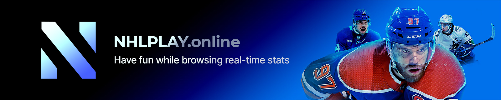

# NHLPLAY - NHL Stats Made Fun

NHLPLAY is a comprehensive web application for tracking NHL hockey statistics, scores, player information, and game data. Built with modern PHP and vanilla JavaScript, this single-page application provides hockey fans with detailed analytics, real-time game tracking, and historical data in an intuitive, responsive interface. The application features a custom routing system, modular architecture, and intelligent caching for optimal performance.

## Features

### Game Tracking & Analysis
- **Live Game Tracking**: Follow ongoing games with real-time score updates, shot counts, penalties, and other key statistics that refresh automatically every 10 seconds
- **Pre-Game Analysis**: View detailed matchup information including head-to-head team statistics, performance trends, and advanced statistical comparisons
- **Player Matchup Highlights**: "Players to Watch" feature showcasing top performers over recent games
- **Game Advantage Calculator**: Proprietary algorithm that calculates pre-game advantage based on team statistics and matchup history
- **Post-Game Summaries**: Comprehensive game summaries with boxscores, three stars selection, and detailed team statistics
- **Game Recap Videos**: Direct access to official NHL game recap videos available within the scores page for completed games

### Team Analysis Tools
- **Complete Team Rosters**: Interactive team rosters with dynamic filtering by position (forwards, defensemen, goalies) and animation effects
- **Advanced Team Statistics**: In-depth team analytics including power play percentage, penalty kill percentage, face-off win percentage, and specialized metrics
- **Game Logs**: Historical game results with performance tracking for each team, filterable by game type
- **Injuries Tracking**: Up-to-date injury reports for all teams with player status and estimated return dates
- **Schedule Integration**: Upcoming games schedule with Swiper.js integration for smooth browsing experience

### Player Statistics & Analytics
- **Interactive Player Profiles**: Modal-based player cards with comprehensive statistics and biographical information
- **Advanced Analytics**: Sophisticated metrics including SAT%, USAT%, Even Strength Goal Differential, and position-specific statistics
- **Career Stats Visualization**: Toggle between season and career statistics with seamless content switching
- **Radar Charts**: Advanced visualization of player performance across various statistical categories compared to league average and elite benchmarks
- **Player Comparison Tool**: Side-by-side comparison of two players' statistics with visual differentiation
- **Recent Performance Tracking**: Analysis of player performance over recent games and trends

### League-wide Features
- **Dynamic Standings**: League, conference, and divisional standings with detailed team performance metrics and interactive sorting
- **Stat Leaders Dashboard**: Comprehensive leaderboards for various statistical categories with position filtering (skaters, defense, goalies, rookies)
- **Playoffs Bracket Visualization**: Interactive Stanley Cup Playoffs bracket with series details and game-by-game results
- **Draft Center**: NHL draft rankings, picks, prospect information with year-to-year comparison capability
- **Trade Tracker**: Monitoring of recent trade activity across the league with visual indicators for new trades
- **Three Stars of the Week**: Weekly recognition of top NHL performers

### Team Building & Management Tools
- **Interactive Team Builder**: Drag-and-drop team building interface with real-time lineup management and position validation
- **Draft Mode Simulation**: Advanced draft simulation with customizable challenge filters and round-by-round player selection
- **Depth Chart Visualization**: Real-time lineup organization with line combinations and defensive pairings
- **State Persistence**: Automatic saving and restoration of team builds across sessions using localStorage
- **Bulk Team Operations**: Clear all players, export lineups, and team management utilities

### Community & Social Features
- **Reddit Game Threads**: Automatic discovery and display of live game discussion threads from r/hockey
- **Team-specific Reddit Feeds**: Curated community posts and discussions for individual NHL teams with live updates
- **Real-time Community Updates**: Live refreshing of community discussions with intersection observer optimization
- **Social Media Integration**: Links to official team social media and community platforms

### User Experience Features
- **Responsive Design Architecture**: Fully optimized for desktop, tablet, and mobile devices with device-specific layouts
- **Dark/Light Mode**: Automatic theme switching based on system preferences with smooth visual transitions
- **Single-Page Application Behavior**: Dynamic content loading without full page refreshes for seamless navigation
- **Player Search**: Instant player search functionality with predictive suggestions and autocomplete
- **Animation Effects**: Smooth transitions and loading animations throughout the interface
- **Performance Optimization**: Smart content caching to reduce API calls and improve load times
- **Accessibility Features**: Tooltips, semantic HTML, keyboard navigation support, and ARIA labels
- **Progressive Enhancement**: Features gracefully degrade for older browsers while maintaining core functionality
- **Lazy Loading**: Intersection observer-based loading of features and content as they enter the viewport

### User Authentication & Profiles
- **User Registration & Login**: Secure authentication system for personalized experience
- **Personal Dashboard**: User-specific dashboard displaying season overview with stat graphs, recent games, stat leaders, and tracked players at a glance
- **Player Tracker**: Follow and monitor specific players with real-time updates on their performance and statistics
- **Profile Management**: Edit user profiles, manage settings, and customize preferences
- **Password Recovery**: Forgot password and reset password functionality
